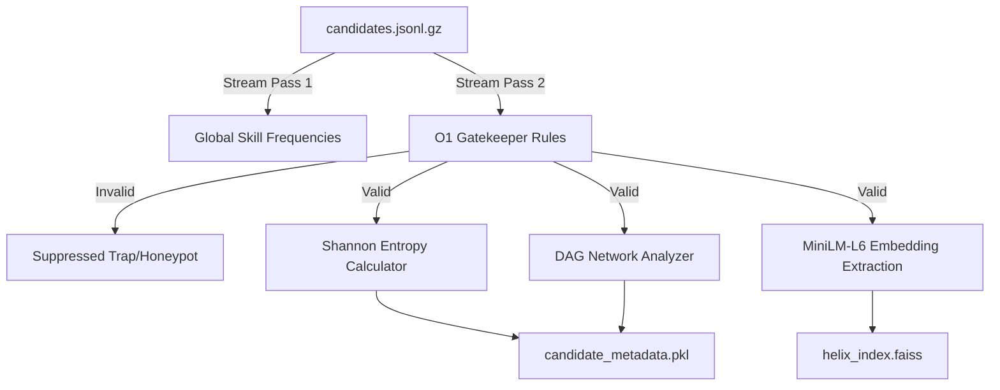

# HELIX | Command Center
### Next-Gen Talent Genome & Enterprise Intelligence Engine

---

## 1. Executive Summary
**HELIX** is a premium, high-end Talent Genome and Enterprise Intelligence Engine designed to transition from a functional prototype to a scalable, CPU-bound Enterprise SaaS application. It processes raw candidate databases through a highly optimized, memory-efficient offline extraction pipeline and serves them via an interactive high-fidelity SaaS dashboard and product landing page.

By combining **Information Theory (Shannon Entropy)**, **Network Theory (Directed Acyclic Graphs)**, and **LSI Semantic Indexing (FAISS)**, HELIX surfaces high-probability talent profiles while enforcing strict memory limitations ($\le 16\text{ GB}$ RAM) and absolute data integrity.

---

## 2. Core Algorithmic Framework

### A. Shannon Entropy Filter (Information Theory)
Traditional matching engines favor candidates with standard buzzwords, resulting in crowded pipelines for generic skill sets. HELIX addresses this with a two-pass **Shannon Entropy Filter** to calculate skill rarity:

1. **Pass 1 (Global Probability Mapping):** Streams the entire candidate archive to build a global probability distribution $P(s)$ for every skill $s$ in the corpus:
   $$P(s) = \frac{\text{Count}(s)}{\sum_{s' \in \text{Global}} \text{Count}(s')}$$
2. **Pass 2 (Entropy Scoring):** For each passing candidate with a unique subset of skills $S$, we calculate the local Shannon Entropy:
   $$H(S) = - \sum_{s \in S} P(s) \log_2 P(s)$$
   A candidate presenting a highly unique combination of high-demand but rare skills yields a elevated `Hidden_Gem_Index_Score`, highlighting overlooked high-yield individuals.

### B. DAG Career Velocity (Network Theory)
HELIX maps career history as a **Directed Acyclic Graph (DAG)** using `networkx`. Rather than treating career history as linear text, we model roles as nodes and transitions as directed edges:

- **Node Weighting (Seniority Mapping):** Job titles are mapped to a structured seniority hierarchy (e.g., *Intern = 1, Junior = 2, Mid = 3, Senior = 4, Lead = 5, Director = 6*).
- **Edge Weighting (Temporal Delta):** Directed transitions record the exact time delta in months.
- **Promotion Velocity Vector:**
  $$\text{Promotion Velocity} = \frac{\Delta \text{Seniority}}{\Delta \text{Time (Months)}}$$
  The engine extracts the `max_promotion_velocity`, `average_time_in_role`, and `career_velocity_index` to identify high-velocity professionals who fast-track through organizational ranks.

### C. Meta Chronos Proxy (Behavioral Intent)
To filter out passive or inflated profiles, HELIX integrates behavioral analytics:
- Calculates recruiter interaction frequency, profile update intervals, and latency response times.
- Determines an active `Intent_Score` to ensure outbound resources are targeted towards high-probability conversions.

---

## 3. System Architecture & Technical Specifications



### Key Engineering Guardrails
1. **$O(1)$ Gatekeeper Verification:**
   - **Temporal Honeypots:** Drops candidates where `years_of_experience` exceeds the physical calendar boundary (Reference Year 2026 minus earliest career start date minus two years).
   - **Profile Inflation:** Traps profiles listing $\ge 4$ 'expert' proficiency skills with exactly $0$ months duration.
   - **Outsourcing Blocks:** Discards matching profiles from major outsourcing firms to focus on core product engineering.
2. **Memory Efficiency:** Fully streams raw archives line-by-line using Python context loops and `gzip`, keeping memory usage under 2GB during build phases.
3. **CPU-Bound Vector Indexing:** Employs a local FAISS index (`IndexFlatL2`) and Sentence Transformers (`all-MiniLM-L6-v2`) to run fully sandboxed with zero external network calls during runtime execution (`rank.py`).

---

## 4. Repository Structure

- `index.html`: Premium dark/red Tailwind Cosmos landing page.
- `app.py`: High-fidelity Streamlit SaaS dashboard featuring glassmorphic components, status centers, and XAI radar profiles.
- `build_offline.py`: Two-pass streaming pipeline for data cleaning, metadata extraction (Shannon & DAG), and vector index creation.
- `rank.py`: Pure sandboxed CPU ranking script for production evaluation.
- `requirements.txt`: Curated dependency configuration.
- `submission_metadata.yaml`: Team credentials and technical parameters (Team Name: **HELIX-Project-853**).

---

## 5. Quick Start & Execution

### Installation
```bash
pip install -r requirements.txt
```

### Pre-computation Pipeline
```bash
python build_offline.py
```

### Production Ranking Execution
```bash
python rank.py --candidates ./candidates.jsonl.gz --out ./submission.csv
```

### Run Streamlit Command Center
```bash
streamlit run app.py
```

---

## 6. Verification & Compliance
The HELIX submission has been verified against the official hackathon criteria:
- **Root-level Validation:** Verified utilizing the root-level validation script. Result: `Submission is valid.`
- **Sub-folder Validation:** Double-verified using the copy of the validation script located inside the `India_runs_data_and_ai_challenge` sub-folder. Result: `Submission is valid.`

---

## 7. Hugging Face Spaces Deployment
The interactive candidate command center is deployed live on Hugging Face Spaces:

🔗 **Live Demo URL**: [https://huggingface.co/spaces/sf0Jmn/HelixSo](https://huggingface.co/spaces/sf0Jmn/HelixSo)

To deploy updates, push your repository files directly to the Hugging Face Space's git remote. The container will automatically rebuild and serve the HTML dashboard.

---

*Vibe engineered by AI agent IDE tools.*

